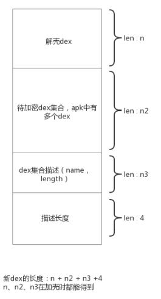
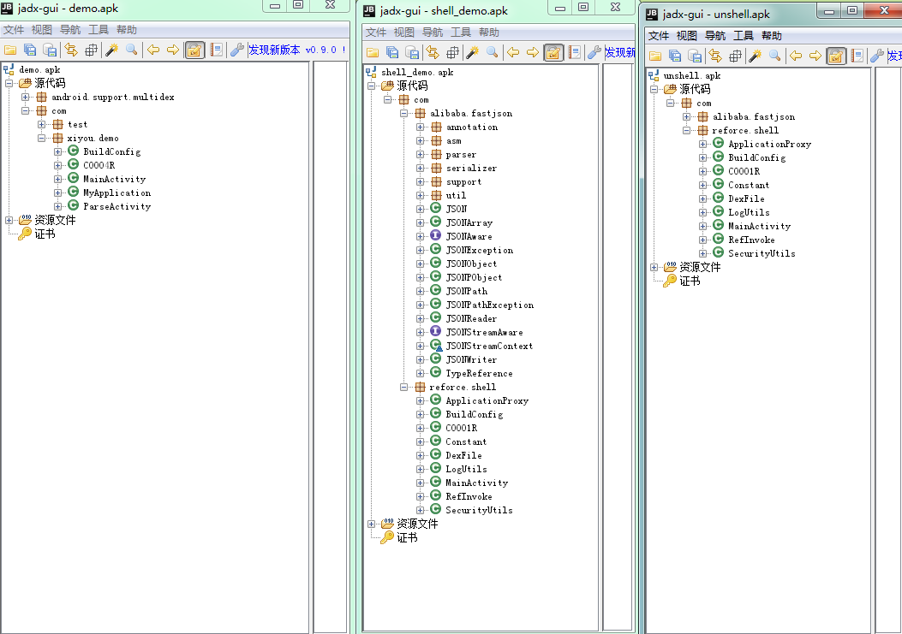

# Android apk加固（加壳）整理 #

**一、Dex加壳由来**  

最近在学习apk加密，在网上看了一篇《[Android中的Apk的加固(加壳)原理解析和实现](https://blog.csdn.net/jiangwei0910410003/article/details/48415225)》，我发现原文把整个apk都写入到dex文件中，如果apk小还好，当原APK大于200M，客户端解壳很费劲，打开后应用就卡住了，如果只是把原apk的dex加壳不就很容易解开了嘛。我不是原创，只是按照我自己的思路将大神的加固稍作调整，并且将整个项目整理如下。  

**二、Dex结构**  
  
如图所示，新的dex由解壳dex、dex集合、dex集合描述和描述长度组成  

**三、核心代码**  

- 加壳
<pre><code>
     /**
     * 给apk加壳
     * @param primaryApkPath 原apk
     * @param unShellApkPath 解壳apk
     * @param outApkPath 加壳后新APK
     * @throws Exception
     */
    public static void apkShell(String primaryApkPath,String unShellApkPath,String outApkPath) throws Exception{
        if(!FileUtils.isExit(primaryApkPath, unShellApkPath)){
            throw new RuntimeException("check params");
        }
        //解压原apk
        String unPrimaryApkDstPath = primaryApkPath.replace(".apk", "");
        ApkToolUtils.decompile(primaryApkPath, unPrimaryApkDstPath);
        String primaryManifestPath = unPrimaryApkDstPath + File.separator + "AndroidManifest.xml";

        //解压解壳apk
        String unShellApkDstPath = unShellApkPath.replace(".apk", "");
        ApkToolUtils.decompile(unShellApkPath, unShellApkDstPath);
        String unShellManifestPath = unShellApkDstPath + File.separator + "AndroidManifest.xml";
        String unShellDexPath = unShellApkDstPath + File.separator + "classes.dex";
        File unShellFile = new File(unShellDexPath);

        File unApkDir = new File(unPrimaryApkDstPath);
        ArrayList&lt;File&gt dexArray = new ArrayList&lt;File&gt();
        for(File file : unApkDir.listFiles()){//读取解壳后的dex
            if(file.getName().endsWith(".dex")){
                dexArray.add(file);
            }
        }
        String shellDexPath = unPrimaryApkDstPath + File.separator + "classes.dex";
        shellDex(dexArray, unShellFile, shellDexPath);//生产新的dex（加壳）

        String mateInfPath = unPrimaryApkDstPath + File.separator +"META-INF";//删除meta-inf，重新签名后会生成
        FileUtils.delete(mateInfPath);

        for(File file : dexArray){//清理多余dex文件
            if(file.getName().equals("classes.dex")){
                continue;
            }
            FileUtils.delete(file.getAbsolutePath());
        }

        String unShellApplicationName = AndroidXmlUtils.readApplicationName(unShellManifestPath);//解壳ApplicationName
        String primaryApplicationName = AndroidXmlUtils.readApplicationName(primaryManifestPath);//原applicationName
        AndroidXmlUtils.changeApplicationName(primaryManifestPath, unShellApplicationName);//改变原Applicationname为解壳ApplicationName
        if(primaryApplicationName != null){//将原ApplicationName写入mateData中，解壳application中会读取并替换应用Application
            AndroidXmlUtils.addMateData(primaryManifestPath, "APPLICATION_CLASS_NAME", primaryApplicationName);
        }
        //回编，回编系统最好是linux
        ApkToolUtils.compile(unPrimaryApkDstPath,outApkPath);
        //v1签名
        SignUtils.V1(outApkPath, SignUtils.getDefaultKeystore());
        //清理目录
        FileUtils.delete(unPrimaryApkDstPath);
        FileUtils.delete(unShellApkDstPath);
    }

    /**
     * 给dex加壳
     * @param primaryDexs 原dex集合
     * @param unShellDex 解壳dex
     * @param shellDexPath 生成新的dex路径
     * @throws IOException
     * @throws NoSuchAlgorithmException
     * @throws InvalidKeyException
     * @throws BadPaddingException
     * @throws NoSuchPaddingException
     * @throws IllegalBlockSizeException
     */
    private static void shellDex(ArrayList&lt;File&gt primaryDexs, File unShellDex, String shellDexPath) throws IOException, NoSuchAlgorithmException, InvalidKeyException, BadPaddingException, NoSuchPaddingException, IllegalBlockSizeException {
        int primaryDexLen = 0;
        ArrayList&lt;DexFile&gt dexFileInfos = new ArrayList&lt;&gt(primaryDexs.size());
        for(File file : primaryDexs){//计算所有primary的长度
            DexFile dexFile = new DexFile(file.getName(),encryptionAES(readFileBytes(file)));
            dexFileInfos.add(dexFile);
            primaryDexLen += dexFile.getDexLength();
        }
        byte[] unShellDexFileByte = readFileBytes(unShellDex);
        int unShellDexLen = unShellDexFileByte.length;//解壳dex长度

        String dexFileComment = JSON.toJSONString(dexFileInfos);//原dexs描述
        int dexFileCommentLen = dexFileComment.getBytes().length;//dexs描述长度

        int totalLen = primaryDexLen+dexFileCommentLen + unShellDexLen+4;//新dex总长度
        byte[] shellDex = new byte[totalLen];

        System.arraycopy(unShellDexFileByte,0,shellDex,0,unShellDexLen);//先拷贝解壳dex

        int currentCopyIndex = unShellDexLen;
        for(DexFile dexFile : dexFileInfos){//拷贝原dexs
            System.arraycopy(dexFile.getData(),0,shellDex,currentCopyIndex,dexFile.getDexLength());
            currentCopyIndex += dexFile.getDexLength();
        }

        System.arraycopy(dexFileComment.getBytes(),0,shellDex,currentCopyIndex,dexFileCommentLen);//加入dexs描述

        System.arraycopy(intToByte(dexFileCommentLen),0,shellDex,totalLen-4,4);//描述长度
        fixFileSizeHeader(shellDex);//修改dex头 file_size值
        fixSHA1Header(shellDex);//修改dex头 sha1值
        fixCheckSumHeader(shellDex);//修改dex头，CheckSum 校验码

        // 把内容写到 newDexFile
        File file = new File(shellDexPath);
        if (!file.exists()) {
            file.createNewFile();
        }

        FileOutputStream localFileOutputStream = new FileOutputStream(shellDexPath);
        localFileOutputStream.write(shellDex);
        localFileOutputStream.flush();
        localFileOutputStream.close();
    }
</pre></code> 
加壳工程是一个java工程，解压apk使用了apktool，apktool这个工具最好是在linux下使用，xml操作使用了W3C java自带的，不咋个好用，为了项目简单没用其他的jar包。加壳项目中对byte数组的加密使用了aes，也可以用其他方法去实现。  

- 解壳 
 
<pre><code> 
 /**
     * 从壳的dex文件中分离出原来的dex文件
     * @param data
     * @param primaryDexDir
     * @throws IOException
     */
    public void splitPrimaryDexFromShellDex(byte[] data, String primaryDexDir) throws IOException, InvalidKeyException, BadPaddingException, NoSuchAlgorithmException, IllegalBlockSizeException, NoSuchPaddingException {
        int shellDexLen = data.length;
        byte[] dexFileCommentLenByte = new byte[4];//dex信息长度
        System.arraycopy(data, shellDexLen-4, dexFileCommentLenByte, 0, 4);
        ByteArrayInputStream bais = new ByteArrayInputStream(dexFileCommentLenByte);
        DataInputStream in = new DataInputStream(bais);
        int dexFileCommentLen = in.readInt();

        byte[] dexFileCommentByte = new byte[dexFileCommentLen];//dex信息正文
        System.arraycopy(data,shellDexLen-4-dexFileCommentLen,dexFileCommentByte,0,dexFileCommentLen);
        String dexFileComment = new String(dexFileCommentByte);
        LogUtils.d("dex comment:"+dexFileComment);
        ArrayList&lt;DexFile&gt dexFileArrayList = (ArrayList&lt;DexFile&gt) JSON.parseArray(dexFileComment,DexFile.class);
        int currentReadEndIndex = shellDexLen - 4 - dexFileCommentLen;//当前已经读取到的内容的下标
        for(int i = dexFileArrayList.size()-1; i&gt=0; i--){//取出所有的dex,并写入到payload_dex目录下
            DexFile dexFile = dexFileArrayList.get(i);
            byte[] primaryDexData = new byte[dexFile.getDexLength()];
            System.arraycopy(data,currentReadEndIndex-dexFile.getDexLength(),primaryDexData,0,dexFile.getDexLength());
            primaryDexData = decryAES(primaryDexData);//界面
            File primaryDexFile = new File(primaryDexDir,dexFile.getDexName());
            if(!primaryDexFile.exists()) primaryDexFile.createNewFile();
            FileOutputStream localFileOutputStream = new FileOutputStream(primaryDexFile);
            localFileOutputStream.write(primaryDexData);
            localFileOutputStream.close();

            currentReadEndIndex -= dexFile.getDexLength();
        }
    }

//代码片段，DexClassLoder加载多个dex
  //找到dex并通过DexClassLoader去加载
    StringBuffer dexPaths = new StringBuffer();
    for(File file:dex.listFiles()){
        dexPaths.append(file.getAbsolutePath());
        dexPaths.append(File.pathSeparator);
    }
    dexPaths.delete(dexPaths.length()-1,dexPaths.length());
    LogUtils.d(dexPaths.toString());
    DexClassLoader classLoader = new DexClassLoader(dexPaths.toString(), odex.getAbsolutePath(),getApplicationInfo().nativeLibraryDir,(ClassLoader) RefInvoke.getFieldOjbect(
            "android.app.LoadedApk", wr.get(), "mClassLoader"));//android4.4后ART会对dex做优化，第一次加载时间较长，后面就很快了
</pre></code>  
将原项目dex从壳dex中获取出来，然后在onCreate中将dex拼接后使用DexClassLoder加载，nativeLibrary咋们只对dex做了加壳所以可以直接使用Application的nativeLibraryDir。
其它核心代码，application替换这类的，可以在原文中查看。  
 
**四、效果**  
  
从左往右分别为原demo工程的apk，为了实现多dex加了很多费代码，加壳后的apk，解壳apk。可以看出加壳后项目demo工程的dex被隐藏，显示的是解壳工程的代码  

**五、待优化**  

1. 将客户端的解密放入native层；
2. 将解密后的dex文件隐藏；

解密后的文件依旧存于应用的私有存储空间中，ROOT了的手机和模拟器很容易就可以拿到解密后的dex，所以这种加壳方法只是将代码从apk中隐藏。
如果有好的解决方法，或者好的加壳方法望告知！

